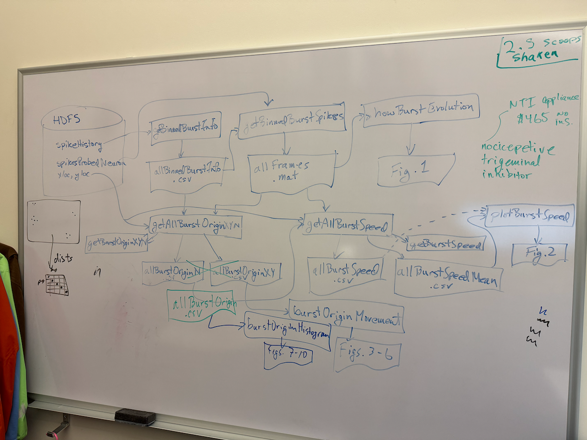

# Burst Data Analysis Workflow

Most of the data analysis associated with analysis of neuron spiking starts with an HDF5 file and proceeds through a series of functions, producing intermediate data files and, eventually, plots. The following whiteboard photo shows the workflow associated with a spatiotemporal bursting analysis paper being written up in 2024-25; it is essentially an update of the thesis, J. Y.-H. Lee, “Machine Learning of Spatiotemporal Bursting Behavior in Developing Neural Networks,” University of Washington, 2018.

