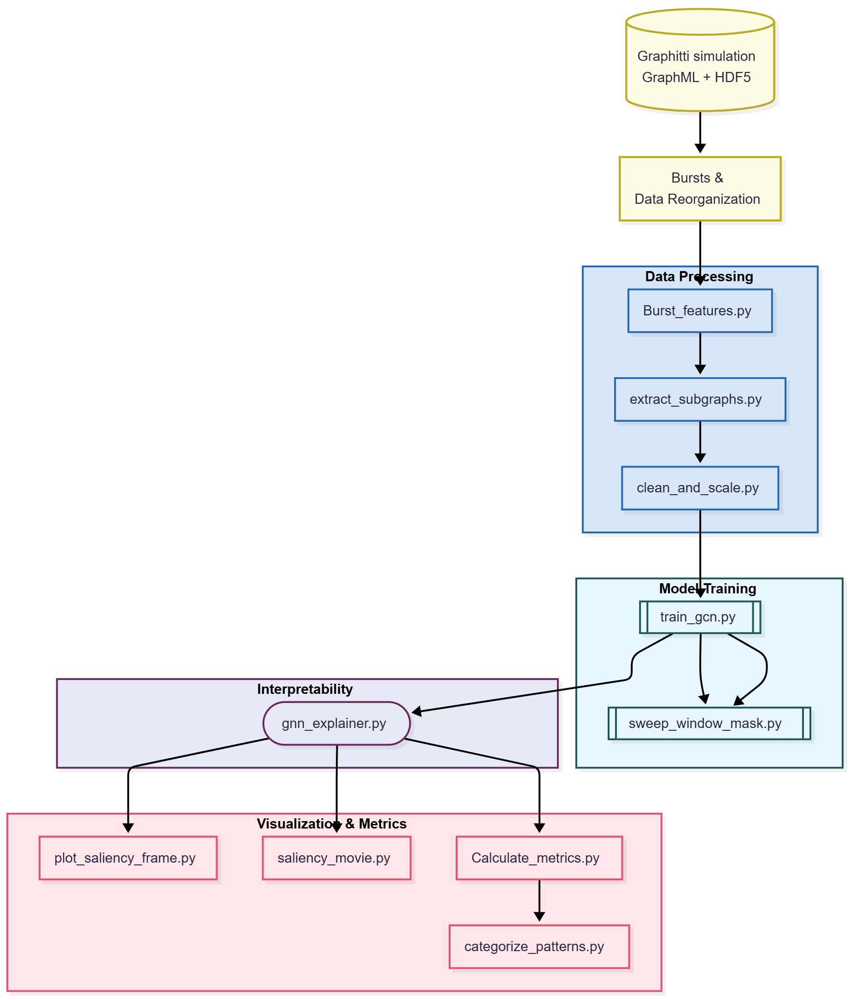

# GNN Burst Interpretation Pipeline

This directory contains the end-to-end pipeline for training and interpreting
graph neural networks (GNNs) on burst activity from Graphitti simulations.

The goal of this code is to:
1. Create burst-centered graph snapshots derived from Graphitti simulations.
2. Train a GNN to distinguish pre-burst vs. non-burst graph states.
3. Use post-hoc explainability (GNNExplainer) to obtain saliency masks.
4. Quantify and categorize the resulting saliency patterns across bursts.

---
# Burst GNN Data Analysis Workflow

It does **not** operate directly on the raw GraphML / HDF5 output, but instead assumes that the existing `Bursts/`workflow in this repository have already processed those files.

To collect the data needed for this GNN + interpretability pipeline, follow the
steps below:

1. **Run a Graphitti simulation**  
   Use a standard Graphitti configuration (e.g., one of the network growth or
   spontaneous activity configs) to generate:
   - Network structure as GraphML (`*.graphml`)
   - Spike trains and related time series as HDF5 (`*.h5`)

2. **Use the GraphSystemsAnalysis /burst tools**  
   From this repository, run the existing `Bursts/` workflow to:
   - Detect bursts and their origin neurons.
   - Extract burst-aligned time windows.

   These steps should produce, for the experiment of interest, files such as:
   - `binned_bursts.csv`  
   - `burst_origins.csv` (or similar) – one origin neuron ID per burst/graph,
     plus additional burst metadata.

3. **Prepare data for GNN training and analysis (this folder)**  
   The files from step (2) are used as input to the data preprocessing scripts
   in `GNN/Data_Processing/` to extract subgraphs from origin neuron, clean, normalize, and optionally         augment the graphs and associated features. The resulting processed graphs are then used
   to train a GNN classifier and to run GNNExplainer to obtain saliency masks.

4. **Train a GNN and run interpretability**  
   The GNN model (typically a GCN) is trained to distinguish pre-burst vs.
   non-burst graph states (or another label defined in your experiment), and
   GNNExplainer is applied to the trained model to obtain node- and edge-level
   saliency scores for each graph.

5. **Quantify and visualize saliency patterns**  
   The explanation outputs (saliency masks) are used to:
   - Plot salient subgraphs in spatial coordinates.
   - Compute graph-level metrics such as the Distance Saliency Index (DSI),
     hop-wise saliency, saliency entropy, and betweenness-centrality summaries.
   - Categorize bursts into qualitative saliency patterns (e.g., local vs.
     remote vs. intermediate patterns).

---

The main scripts in this directory implement the above workflow:

### Data Processing (`GNN/Data_Processing/`)

- `Burst_features.py`  
  Compute burst-level and/or graph-level features (e.g., burst duration,
  total spikes, spatial spread) from the preprocessed Graphitti output and
  per-burst metadata.

- `extract_subgraphs.py`  
  Construct or refine PyTorch Geometric `Data` objects for each burst or
  control window, using:
  - Graph structure derived from GraphML.
  - Node features derived from binned spike trains or other activity measures.
  Outputs or updates `graphs.pt` and associated metadata.

- `clean_and_scale.py`  
  Clean feature tables and graph metadata, apply scaling/normalization, and
  optionally create train/validation/test splits.

### Model Training (`GNN/Model/`)

- `train_gcn.py`  
  Train a graph convolutional network (GCN) on the graphs in `graphs.pt` to
  classify pre-burst vs. non-burst (or other labels). Saves the trained model
  checkpoint and basic training metrics.

- `sweep_window_mask.py`  
  Run parameter sweeps around the training and interpretation setup, such as:
  - Pre-burst time window length
  - Saliency threshold / top-P% selection
  - Other model or training hyperparameters

### Interpretability (`GNN/Interpretability/`)

- `gnn_explainer.py`  
  Apply GNNExplainer to a trained GNN and the graph dataset to generate:
  - `node_mask.pt` – node-level saliency scores
  - `edge_mask.pt` – edge-level saliency scores

