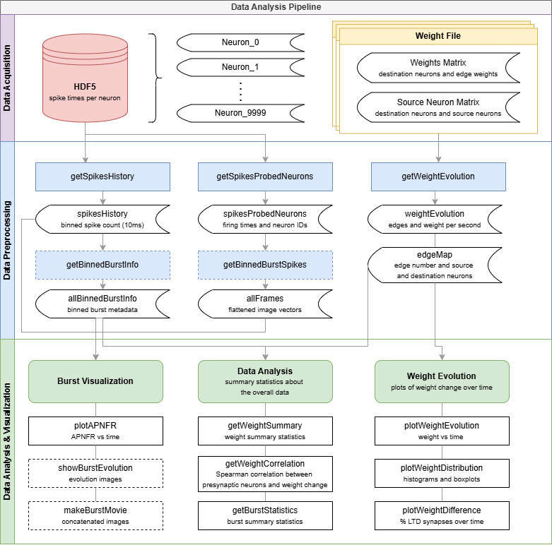

# STDP Data Analysis Workflow

## Overview
This workflow relies on the weight matrix output from running an STDP simulation in Graphitti. To collect this data, follow the below steps:
1. Run a growth simulation where the edge class is type AllSpikingSynapses or a sublcass of AllSpikingSynapses. (ex: [Graphitti/configfiles/tR_1.0--fE_0.90_10000.xml](https://github.com/UWB-Biocomputing/Graphitti/blob/SharedDevelopment/configfiles/tR_1.0--fE_0.90_10000.xml)).
2. Locate the final weight matrix output at the end of the growth simulation. It should be saved to ./Output/Results/weights-epoch-&lt;EPOCH_NUM>&gt;
3. Run the [Graphitti/Tools/XMLToGraphML/getGraphEdges.py](https://github.com/UWB-Biocomputing/Graphitti/blob/SharedDevelopment/Tools/XMLToGraphML/getGraphEdges.py) file with the weight matrix to generate a graphml file.
4. Use the graphml file as input to the STDP simulation. (ex: [Graphitti/configfiles/stdp_fE_0.90_10000.xml](https://github.com/UWB-Biocomputing/Graphitti/blob/SharedDevelopment/configfiles/stdp_fE_0.90_10000.xml)).
5. The weight matrix output from the STDP simulation is used as input to the data preprocessing scripts shown in the workflow diagram below.

## Diagram

STDP Analysis Workflow Diagram from Vanessa Arndorfer's Thesis "Network Behavior Analysis of Spike Timing Dependent Plasticity
(STDP) in Simulated Neural Networks," University of Washington, 2025

